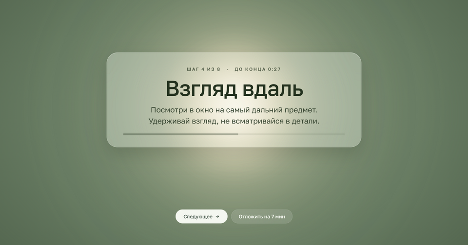

# Гимнастика для глаз

Раз в час программа напоминает дать глазам отдых: на весь экран открывается
зарядка из 8 упражнений на 3 минуты 10 секунд — со звуком поющей чаши
и анекдотом в конце. Работает на Windows и Mac, живёт в трее.



## Скачать

Последняя версия — на странице [релизов](https://github.com/nastyaa-zdraste-design/eye-gymnastics/releases/latest).

| Система | Файл |
|---|---|
| Windows 10 и 11 | `Eye-Gymnastics-Setup-…exe` |
| Mac на Apple M1–M4 | `Eye-Gymnastics-…-arm64.dmg` |
| Mac на Intel | `Eye-Gymnastics-…-x64.dmg` |

### Установка на Windows

1. Запусти скачанный `.exe`.
2. Если появится «Windows защитил ваш компьютер», нажми **«Подробнее» →
   «Выполнить в любом случае»**. У программы пока нет платной подписи,
   поэтому Windows её не узнаёт.
3. Установка пройдёт сама, программа запустится.

### Установка на Mac

У программы пока нет подписи Apple, поэтому при первом запуске macOS
её не откроет. Разрешить нужно один раз — дальше спрашивать не будет.

1. Открой скачанный `.dmg` и перетащи глазик в папку **«Программы»**.
2. Открой «Программы» и запусти «Гимнастику для глаз». Появится окно
   «Файл не был открыт» — нажми **«Готово»**.
   Не нажимай «Переместить в Корзину».
3. Открой **Системные настройки → Конфиденциальность и безопасность**.
4. **Пролистай страницу вниз до раздела «Безопасность».** Там будет строчка
   про «Гимнастику для глаз» и кнопка **«Всё равно открыть»**. Нажми её
   и введи пароль от Mac.
5. Программа запустится.

Кнопка «Всё равно открыть» появляется только после попытки запуска
из шага 2 и держится около часа. Если её нет или macOS пишет,
что программа повреждена, открой «Терминал» и выполни:

```bash
xattr -cr "/Applications/Гимнастика для глаз.app"
```

После установки новой версии разрешить запуск нужно снова.

## Проверь, что всё работает

1. Найди глазик: на Mac — в строке меню вверху экрана, на Windows —
   в трее справа внизу (может прятаться под стрелкой **^**).
2. Нажми на него — откроется меню. Вверху должно быть
   **«Перерыв через 59 мин»** (или 58) и **«Без переносов»**.
   Значит, отсчёт пошёл.
3. Там же, в пункте **«Интервал»**, можно выбрать, как часто делать перерыв:
   30, 45, 60 или 90 минут.

> [!IMPORTANT]
> Перерыв открывается на весь экран поверх всех окон — даже поверх чатов
> и созвонов. Кнопки «Закрыть» нет. Чтобы вернуться к работе, нажми
> **«Отложить»** или **Esc**. После нескольких переносов кнопку нужно
> удерживать.

## Как пользоваться

В меню глазика: перерыв сейчас, отложить, интервал, звуки, щадящий режим,
автозапуск, свои тексты и «О программе».

Во время перерыва:
- **Пробел** — следующее упражнение
- **Esc** — отложить

## Если отложить

Откладывать можно сколько угодно, но чем чаще, тем быстрее перерыв
возвращается и тем настойчивее программа о себе напоминает.

| Отложено | Вернётся через | Что происходит |
|---|---|---|
| 1 раз | 20 мин | ничего |
| 2 раза | 15 мин | из-за края экрана выглядывают глаза |
| 3 раза | 10 мин | глаза чаще и сонные |
| 4 раза | 7 мин | за курсором тянутся курсоры-призраки; отложить — только удержанием кнопки |
| 5 и больше | 5 мин | по краям экрана темнеет дымка |

После переноса перерыв начинается с экрана со смешной подписью.
Клик по глазам сразу открывает зарядку. Зарядка до конца или 5 минут
в заблокированном компьютере обнуляют счёт. **Щадящий режим** в меню
отключает глаза, призраков и дымку.

## Если смотришь фильм

Если мышь не двигается 5 минут, программа считает, что ты смотришь фильм,
и не показывает перерыв. Он откроется, когда мышью снова начнут работать.
Короткое движение — пауза, громкость — ничего не запускает.

## Свои упражнения и анекдоты

Меню → «Открыть папку с текстами». Там `exercises.txt` и `jokes.txt`,
формат описан в начале каждого файла. Правки подхватываются со следующего
перерыва.

## Обновления

- **Windows:** новая версия скачивается сама и ставится при выходе
  из программы. Можно и сразу: меню → «Обновить до …».
- **Mac:** в меню появляется «Скачать версию …» со ссылкой на новую версию.

## Данные

Программа ничего никуда не отправляет. В интернет она ходит только
за проверкой обновлений на GitHub, раз в несколько часов. Настройки и журнал:

- Windows — `%APPDATA%\Гимнастика для глаз`
- Mac — `~/Library/Application Support/Гимнастика для глаз`

## Здоровье

Это не медицинское изделие. При боли, вспышках, «мушках» или резком
ухудшении зрения прекрати упражнения и обратись к офтальмологу.

## Для разработчиков

```bash
npm install
npm start                         # запуск
npm run check                     # проверки логики
npx electron . --now --short      # перерыв сразу, шаги по 6 секунд
npx electron . --nag=4            # сразу 4 переноса — посмотреть глаза и призраков
node scripts/make-icon.js         # пересобрать иконку
```

Выпуск версии: поменять `version` в `package.json`, закоммитить
и отправить метку `vX.Y.Z`. GitHub Actions соберёт установщики
для Windows и Mac и положит их в черновик релиза — его остаётся
проверить и опубликовать.

Макеты интерфейса — в папке `design`.

## Лицензии

- Код — MIT, см. [LICENSE](LICENSE).
- Звуки поющих чаш — Викисклад, участник «דג בלי מלח», CC BY-SA 4.0,
  см. [assets/sounds/LICENSE-SOUNDS.txt](assets/sounds/LICENSE-SOUNDS.txt).
- Шрифт Golos Text — SIL Open Font License 1.1, см. [assets/fonts/OFL.txt](assets/fonts/OFL.txt).
